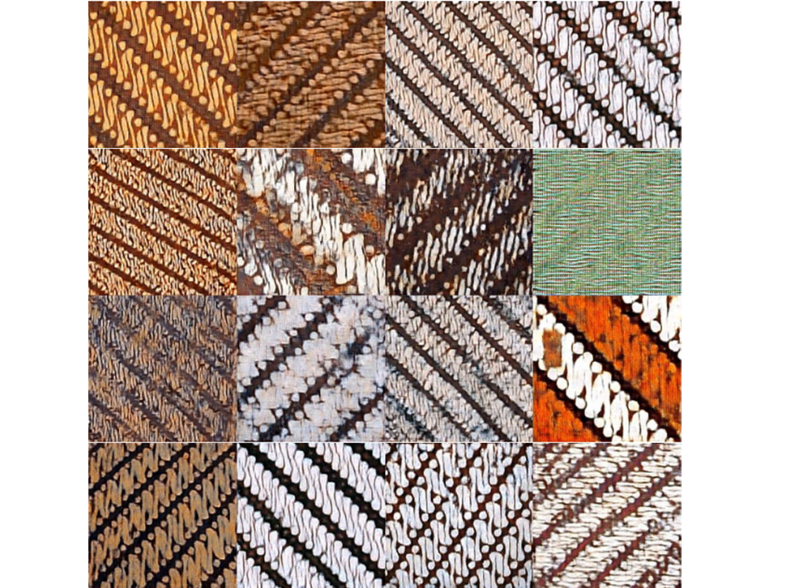
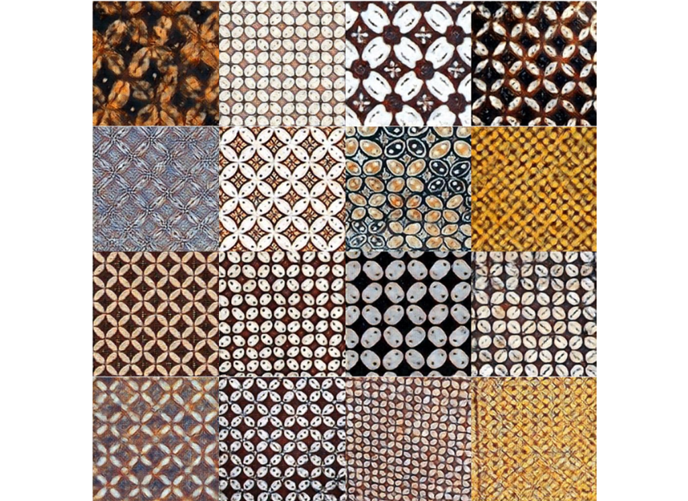
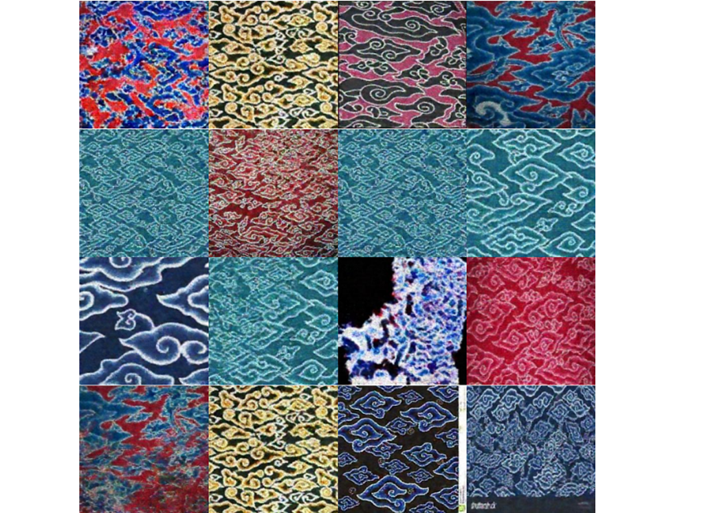

# Batik Generator Lightweight GAN - Kelompok 14

Proyek ini bertujuan untuk menghasilkan citra motif batik sintetik berkualitas tinggi menggunakan arsitektur **Lightweight GAN** (Generative Adversarial Networks). Pendekatan ini dirancang untuk mengatasi tantangan *few-shot learning* (keterbatasan data) dan efisiensi komputasi dalam pelestarian budaya digital.
## 📄 Tautan Penting

* **Dokumen Laporan Final Project:** [Dokumen(PDF)](https://drive.google.com/file/d/1W5eXhJe_OI6jqs2N3mFKg11OycJg7nmz/view?usp=sharing)
* **Dokumen Laporan Cek Turnitin:** [Dokumen(PDF)](https://drive.google.com/file/d/1NFwxHCn3neVxXRkCVUHXIygTZc0V9f9E/view?usp=sharing)
* **Dokumen Laporan Cek Zero GPT:** [Dokumen(PDF)](https://drive.google.com/file/d/1ccItjIURFpF1iYgnpTj6Mp92b8q8X_Ms/view?usp=sharing)
* **Video Demo/Presentasi:** [Video Demo (Google Drive)](https://drive.google.com/file/d/1CX9W4rbr3puyhVlhjfkcSlzFLoKFwuJF/view?usp=drive_link)

## 👥 Anggota Kelompok 14

Berikut adalah kontribusi anggota tim dalam pengerjaan proyek ini:

| NIM | Nama | Peran & Kontribusi |
| :--- | :--- | :--- |
| **1.23.11.5595** | **Wirawan Ariyoso** | Mencari dataset, melatih model, membuat laporan & video  |
| **2.23.11.5596** | **Yuafiq Alfin Al Khasan** | Mencari dataset, melakukan EDA (Exploratory Data Analysis), melatih model |
| **3.23.11.5609** | **Adhitya Surya Handika** | Melatih model, membuat laporan, cek plagiarisme & AI |

## 📖 Latar Belakang

Batik memiliki kompleksitas visual yang tinggi, mulai dari ragam motif hingga pola warna, yang menyulitkan sistem visi komputer konvensional. Generative Adversarial Networks (GAN) menawarkan solusi, namun seringkali membutuhkan dataset yang sangat besar (seperti StyleGAN2) dan rentan terhadap masalah stabilitas pelatihan (*mode collapse*) jika data terbatas.

Proyek ini mengadopsi **Lightweight GAN** yang didukung modul *Skip-Layer channel-wise Excitation* (SLE) dan teknik *Differentiable Augmentation* (DiffAugment) untuk menghasilkan motif batik yang estetika dan realistis dengan sumber daya komputasi minimal dan dataset terbatas.

## ⚙️ Arsitektur & Metode

Model ini menggunakan resolusi gambar **256x256 piksel** dengan fitur utama:
* **Generator (G):** Menggunakan modul SLE untuk memperkuat aliran gradien dan mempercepat konvergensi tanpa beban konvolusi berat.
* **Diskriminator (D):** Berbasis *auto-encoder* (self-supervised) untuk mengekstrak fitur deskriptif.
* **Optimasi:** Menggunakan algoritma Adam dengan *Two Time-Scale Update Rule* (TTUR) untuk stabilitas.
* **Data Efficiency:** Menggunakan *Differentiable Augmentation* (DiffAugment) untuk mencegah overfitting pada diskriminator.

### Pipeline Pengerjaan
1.  **Data Selection:** Dataset Batik dari Kaggle (Batik Parang, Megamendung, Kawung).
2.  **Preprocessing:** Konversi ke RGB, Resize 256x256, Center Crop.
3.  **Training:**
    * *Skenario A (From Scratch):* Batik Parang & Megamendung.
    **Skenario B (Transfer Learning):* Batik Kawung (inisialisasi bobot dari Batik Parang).
4.  **Evaluasi:** Menggunakan metrik *Fréchet Inception Distance* (FID).

## 📊 Hasil Eksperimen

Evaluasi dilakukan berdasarkan skor FID (semakin rendah semakin baik).

| Skenario | Dataset | Jumlah Steps | Batch Size | Skor FID Akhir | Catatan |
| :--- | :--- | :--- | :--- | :--- | :--- |
| A (Scratch) | Batik Parang | 20.000 | 16 | **293** | Kesulitan pada pola geometris diagonal |
| A (Scratch) | Batik Megamendung | 20.000 | 64 | **150** | **Hasil Terbaik.** Batch size besar meningkatkan stabilitas  |
| B (Transfer) | Batik Kawung | 30.000 | 16 | **189** |Transfer learning mempercepat konvergensi  |

</img>

*256x256 batik parang setelah training selama 8 jam, 1 gpu T4*

</img>

*256x256 batik parang setelah training selama 3 jam, 1 gpu T4*

</img>

*256x256 batik parang setelah training selama 2 hari, 1 gpu RTX 3060*

### Kesimpulan Hasil
* **Batch Size:** Penggunaan batch size besar (64) pada Batik Megamendung terbukti krusial menghasilkan skor FID terbaik (150).
* **Transfer Learning:** Efektif untuk adaptasi domain baru.Batik Kawung mencapai FID 189 dengan memanfaatkan bobot dari Batik Parang, jauh lebih baik daripada pelatihan dari nol pada dataset yang sulit.
  **Efisiensi:** Arsitektur Lightweight GAN terbukti mampu mencegah *mode collapse* pada dataset kecil (<150 citra per kelas).

## 💻 Lingkungan Pengembangan

Eksperimen dijalankan pada dua lingkungan:
* **Google Colab:** GPU Tesla T4 (15GB).
* **Lokal:** GPU RTX 3060 (12GB).

## 📚 Referensi Utama

1. H. Prasetyo and B. A. Putra Akardihas, “Batik image retrieval using convolutional neural network,” Telkomnika, 2019.
2.  S. Zhao, et al., “Differentiable Augmentation for Data-Efficient GAN Training,” 2020.
3.  B. Liu, et al., “Towards Faster and Stabilized GAN Training for High-Fidelity Few-Shot Image Synthesis” (FastGAN).

---
*Dibuat untuk memenuhi tugas Final Project Mata Kuliah Kecerdasan Buatan (Lanjut).*

